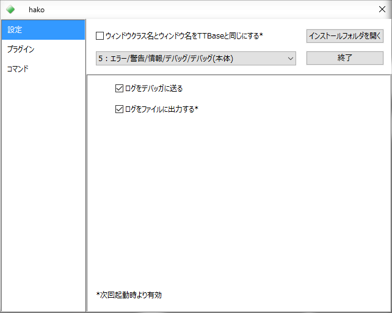
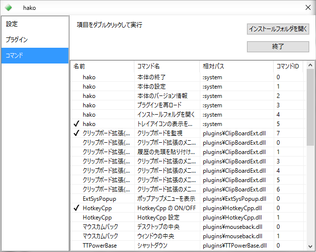

#TTBaseHost

A sample for TTBase compatible application.  
Compilable with: **Visual Studio Community 2015 (C++11, 32/64-bit)**

##Contents

---

- TTBaseHost.sln
- TTBaseHost.vcxproj
- TTBaseHost.vcxproj.filters
- TTBaseHost.vcxproj.user
- WinMain.cpp
- PluginMgr.hpp
- PluginMgr.cpp
- Command.hpp
- System.cpp
- MainWnd.hpp
- MainWnd.cpp
- Settings.hpp
- BridgeData.hpp
- TTBBridgePlugin.hpp
- TTBBridgePlugin.cpp
- icon.ico
- resource.h
- TTBaseHost.rc
- compatibility.manifest
- dpiAware.manifest
- NYSL.TXT
- [include]
 - Font.hpp
 - File.hpp
 - UWnd.hpp
 - UWnd.cpp
 - CtrlWnd.hpp
 - Application.hpp
 - CollectFile.hpp 

---

To compile, you also require files below

- TTBaseHost.def
- Plugin.hpp
- Plugin.cpp
- MessageDef.hpp
- MessageDef.cpp
- Utility.hpp
- Utility.cpp
- x86.manifest
- amd64.manifest

from the 'TTBase plugin template project'.

---

##Description

　This is an application compatible with [**TTBase**](https://osdn.jp/projects/ttbase/). This sample is written partially based on the source code of [**peach**](http://white2.php.xdomain.jp/?page_id=27) which is produced by U.  
　This is nothing but a compatible application, so it does not function the same as TTBase. I don't recommend you to use this as an alternative for TTBase or peach because some functions are not implemented yet. I hope you could find something from this sample as an implementation in C++11.  
　The biggest feature of this program is that **you can use both 32/64-bit plugins with one 64-bit host application**.

---

##Functions

###Implemented
- Loading plugins
- Executing commands
- Providing GUI
- Indicating task-tray icons
- Changing task-tray icons by plugins
- System Menu
- Logging
- Saving the settings to the .ini file
- Loading and executing 32/64-bit plugins with one 64-bit host application

###Not Implemented
- Hotkey function
- Timer function
- Windows Hook
- Command line options

　The concept is baed on _peach_. This program does not provide some functions that TTBase does as the host services, and let them go with plugins.  
　The main difference from _peach_ is serving the task-tray icon as a function of the host application. You can switch the visibility of the icon by a command.  
　If you want to show the UI window when the icon is invisible, call the command with the hotkey of plugins or simply double-start the application.

###Screen Shots
  
  
  
---

##License

NYSL Version 0.9982
```
A. 本ソフトウェアは Everyone'sWare です。このソフトを手にした一人一人が、
   ご自分の作ったものを扱うのと同じように、自由に利用することが出来ます。

  A-1. フリーウェアです。作者からは使用料等を要求しません。
  A-2. 有料無料や媒体の如何を問わず、自由に転載・再配布できます。
  A-3. いかなる種類の 改変・他プログラムでの利用 を行っても構いません。
  A-4. 変更したものや部分的に使用したものは、あなたのものになります。
       公開する場合は、あなたの名前の下で行って下さい。

B. このソフトを利用することによって生じた損害等について、作者は
   責任を負わないものとします。各自の責任においてご利用下さい。

C. 著作者人格権は tapetums に帰属します。著作権は放棄します。

D. 以上の３項は、ソース・実行バイナリの双方に適用されます。
```

NYSL Version 0.9982 (en) (Unofficial)
```
A. This software is "Everyone'sWare". It means:
  Anybody who has this software can use it as if he/she is
  the author.

  A-1. Freeware. No fee is required.
  A-2. You can freely redistribute this software.
  A-3. You can freely modify this software. And the source
      may be used in any software with no limitation.
  A-4. When you release a modified version to public, you
      must publish it with your name.

B. The author is not responsible for any kind of damages or loss
  while using or misusing this software, which is distributed
  "AS IS". No warranty of any kind is expressed or implied.
  You use AT YOUR OWN RISK.

C. Copyrighted to tapetums

D. Above three clauses are applied both to source and binary
  form of this software.
```

[http://www.kmonos.net/nysl/](http://www.kmonos.net/nysl/)

---

##Acknowledgements

I express deep respect and appreciation to K2 who has created TTBase, U who producted and published peach, the author of TTBaseCpp,  
and the authors who produced the great number of plugins for TTBase.

---

###Change  Log

2016.02.13 v0.3.0.0
- Does not show unnecessary checkboxes
- Improved the measure for forbidding double-start in some case
- Improved the system menu
- Shows the bit count of plugins in the plugin list
- Corrected the memory leak in 32/64-bridge

2016.02.12 v0.2.0.0
- In the 64-bit version, now both 32/64-bit plugins are executable.

2016.02.07  v0.1.0.0
- First Edition

---

Thanks for reading.

####Edited by
tapetums

######This document is under the license of NYSL Version 0.9982.  
######[http://www.kmonos.net/nysl/](http://www.kmonos.net/nysl/)
