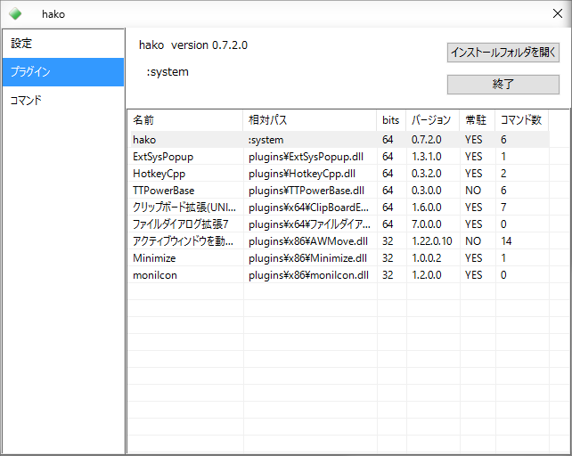

#TTBaseHost

TTBase 互換プログラムのサンプルです。  
**Visual Studio Community 2015 (C++11, 32/64-bit)** でコンパイルを確認しています。

##内容

---

- TTBaseHost.sln
- TTBaseHost.vcxproj
- TTBaseHost.vcxproj.filters
- TTBaseHost.vcxproj.user
- WinMain.cpp
- PluginMgr.hpp
- PluginMgr.cpp
- Command.hpp
- System.cpp
- MainWnd.hpp
- MainWnd.cpp
- Settings.hpp
- BridgeData.hpp
- TTBBridgePlugin.hpp
- TTBBridgePlugin.cpp
- icon.ico
- resource.h
- TTBaseHost.rc
- TTBaseHost.def
- compatibility.manifest
- dpiAware.manifest
- NYSL.TXT
- [include]
 - Font.hpp
 - File.hpp
 - UWnd.hpp
 - UWnd.cpp
 - CtrlWnd.hpp
 - Application.hpp
 - CollectFile.hpp 

---

コンパイルするためには、上記に加え  
TTBase プラグインスケルトンプロジェクトから

- Plugin.hpp
- Plugin.cpp
- MessageDef.hpp
- MessageDef.cpp
- Utility.hpp
- Utility.cpp
- x86.manifest
- amd64.manifest

が必要です。

---

##説明

　[**TTBase**](https://osdn.jp/projects/ttbase/) の互換アプリケーションです。このサンプルプログラムは、U さんが作られた [**peach**](http://white2.php.xdomain.jp/?page_id=27) のソースコードを一部参考にして作られました。  
　あくまで互換アプリケーションであるため、 TTBase と同じ動作にはなりません。実装されていない機能もあり、TTBase や peach の代替としてお使いになることは推奨いたしません。C++11による実装の一例としてご活用いただければと思います。  
　最大の特徴として、64ビット版の本体のみで **32ビット版と64ビット版 両方のプラグインを使用可能**なことが挙げられます。


---

##機能

###実装済みの機能
- プラグインの読み込み
- コマンドの実行
- GUI の提供
- タスクトレイアイコンの表示
- プラグインによるタスクトレイアイコンの変更
- システムメニュー / ツールメニュー
- ログの出力
- .ini ファイルへの 設定の保存
- 64ビット版の本体から 32ビット版のプラグインを読み込んで実行

###未実装の機能
- 本体によるホットキー機能の提供
- 本体によるタイマー機能
- 本体によるフックの提供
- コマンドラインオプション

　コンセプトは peach を参考にしており、 TTBase では本体の機能として提供していたものであっても、プラグイン側に任せる、という姿勢をとっています。  
　peach との違いは、本体側でタスクトレイアイコンを実装していることです。タスクトレイアイコンの表示に関しては、コマンドで ON/OFF を切り替えられます。  
　なお、タスクトレイアイコンが表示されていない状態で UI ウィンドウを表示させるには、プラグインによるホットキーからコマンドを呼び出すか、アプリケーションを二重起動させて下さい。

###スクリーンショット
  
  
  

---

##ライセンス

NYSL Version 0.9982
```
A. 本ソフトウェアは Everyone'sWare です。このソフトを手にした一人一人が、
   ご自分の作ったものを扱うのと同じように、自由に利用することが出来ます。

  A-1. フリーウェアです。作者からは使用料等を要求しません。
  A-2. 有料無料や媒体の如何を問わず、自由に転載・再配布できます。
  A-3. いかなる種類の 改変・他プログラムでの利用 を行っても構いません。
  A-4. 変更したものや部分的に使用したものは、あなたのものになります。
       公開する場合は、あなたの名前の下で行って下さい。

B. このソフトを利用することによって生じた損害等について、作者は
   責任を負わないものとします。各自の責任においてご利用下さい。

C. 著作者人格権は tapetums に帰属します。著作権は放棄します。

D. 以上の３項は、ソース・実行バイナリの双方に適用されます。
```

NYSL Version 0.9982 (en) (Unofficial)
```
A. This software is "Everyone'sWare". It means:
  Anybody who has this software can use it as if he/she is
  the author.

  A-1. Freeware. No fee is required.
  A-2. You can freely redistribute this software.
  A-3. You can freely modify this software. And the source
      may be used in any software with no limitation.
  A-4. When you release a modified version to public, you
      must publish it with your name.

B. The author is not responsible for any kind of damages or loss
  while using or misusing this software, which is distributed
  "AS IS". No warranty of any kind is expressed or implied.
  You use AT YOUR OWN RISK.

C. Copyrighted to tapetums

D. Above three clauses are applied both to source and binary
  form of this software.
```

[http://www.kmonos.net/nysl/](http://www.kmonos.net/nysl/)

---

##謝辞

TTBase を生み出された K2 さん、peach を 公開されている U さん、TTBaseCpp の作者さんを始め、  
数多くのプラグインを作られたそれぞれの作者さんたちに深い敬意と感謝を表します。

---

###変更履歴
2016.02.21 v0.5.0.0
- システムメニューを階層化
- ログレベルが 0 のとき ログファイルを生成しないようにした
- コマンド一覧でチェックマークが出なくなっていた問題を修正

2016.02.16 v0.4.0.0
- ツールメニューの実装
- 安定性の向上

2016.02.16 v0.3.1.0
- 安定性の向上

2016.02.13 v0.3.0.0
- コマンド一覧で無関係なチェックボックスを表示しないようにした
- タイミングによっては二重起動してしまう問題を改善
- システムメニューを改善
- プラグイン一覧でプラグインのビット数を表示するようにした
- 32-64ブリッヂのメモリリークを修正
 
2016.02.12 v0.2.0.0
- 64ビット版本体に限り、32ビット版と64ビット版 両方のプラグインを動かせるようになった

2016.02.07  v0.1.0.0
- 初版発行

---

以上です。

####文責
tapetums

######この文書のライセンスは NYSL Version 0.9982 とします。  
######[http://www.kmonos.net/nysl/](http://www.kmonos.net/nysl/)
